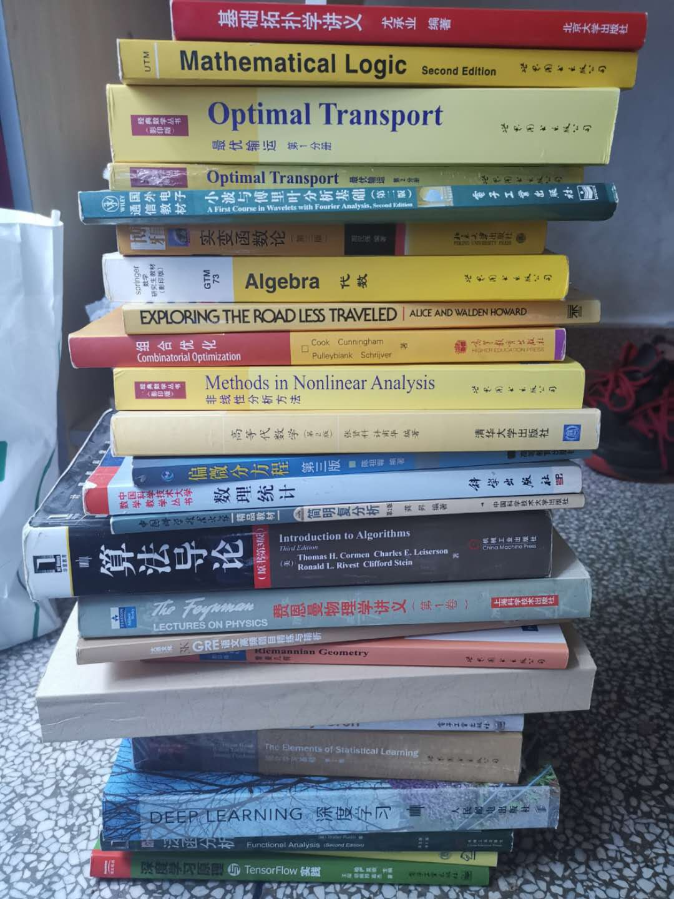

下面的书你们如果需要就联系我鸭，带不走了，希望送给你之后能好好对它们。坐标USTC东校区321楼。

[Optimal transport(最优传输)](https://www.springer.com/gp/book/9783540710493)

[Mathematical logic(数理逻辑)](https://www.springer.com/gp/book/9780387942582)

[Algebra(代数)](https://www.springer.com/la/book/9780387905181)

[基础拓扑学讲义](https://www.amazon.cn/dp/B00W76CZ1C)

[实变函数论(第三版)](https://item.jd.com/12063386.html)

[小波与傅里叶分析基础](https://item.jd.com/27426004763.html)

[算法导论(第三版)](https://item.jd.com/11144230.html)

[简明复分析(第二版)](https://item.jd.com/27252230740.html)

[偏微分方程(第三版)](https://item.jd.com/36303549372.html)

[高等代数学(第二版)](https://www.amazon.cn/dp/B016OLNFE6)

[Methods in Nonlinear Analysis(非线性分析方法)](https://www.springer.com/la/book/9783540241331)

[Discrete mathematics(离散数学)](https://www.springer.com/gp/book/9780387955841)

[深度学习原理与tf实践](https://item.jd.com/12186034.html)

[深度学习入门之pytorch](https://github.com/L1aoXingyu/code-of-learn-deep-learning-with-pytorch)

[Deep Learning](https://www.deeplearningbook.org/)

[Functional Analysis(泛函分析)](https://item.jd.com/1245556866.html)

[Functional Analysis(泛函分析)](https://item.jd.com/1245556866.html)

[The Elements of Statistical Learning](https://www.amazon.com/Elements-Statistical-Learning-Prediction-Statistics/dp/0387848576)

[Intro to Differentiable Manifolds(微分流形导论)](https://www.springer.com/kr/book/9780387954776)

[Algebraic Geometry and Arithmetic Curves](https://www.math.u-bordeaux.fr/~qliu/Book/)

[Riemannian Geometry(黎曼几何)](https://press.princeton.edu/titles/486.html)

[GRE语文高频题目精练与精析](https://www.amazon.com/GRE%E8%AF%AD%E6%96%87%E9%AB%98%E9%A2%91%E9%A2%98%E7%9B%AE%E7%B2%BE%E7%BB%83%E4%B8%8E%E7%B2%BE%E6%9E%90-Chinese-%E9%99%88%E7%90%A6-%E4%B8%BB%E7%BC%96-ebook/dp/B071YP7HST)

[费曼物理学讲义(第一卷)](https://book.douban.com/subject/1437852/)

